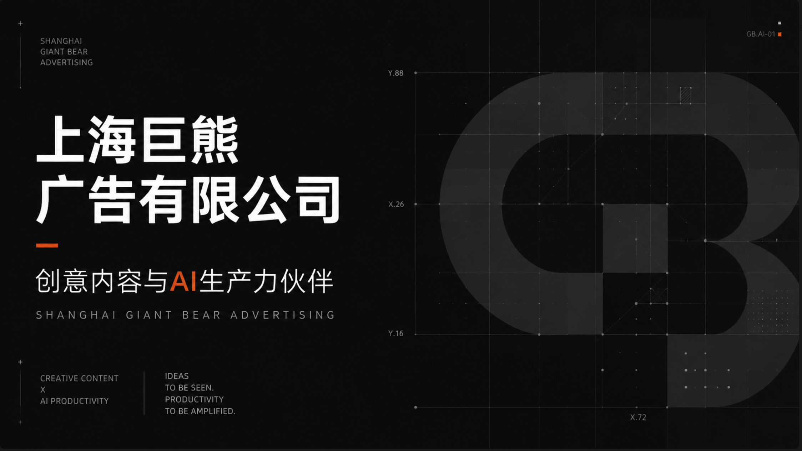
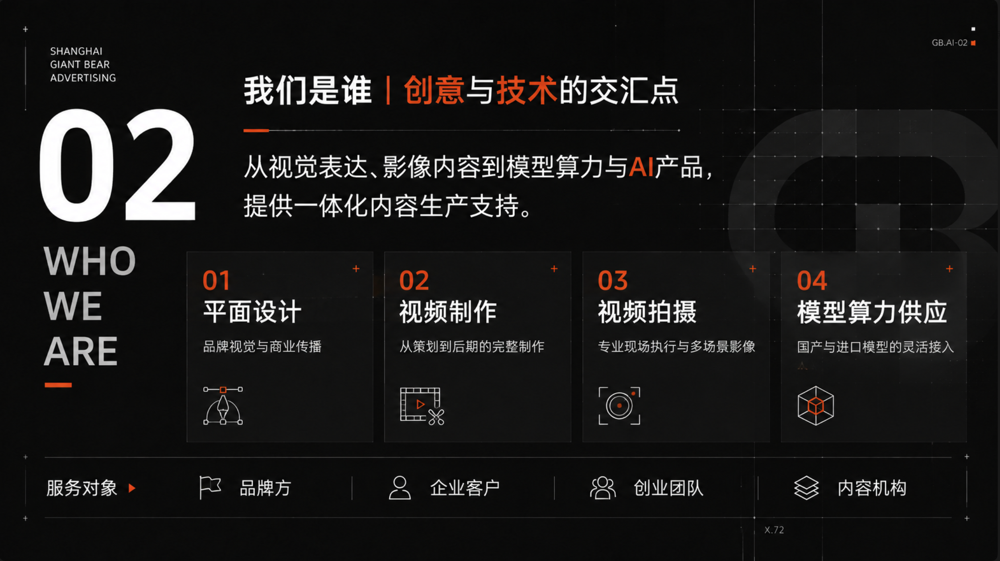
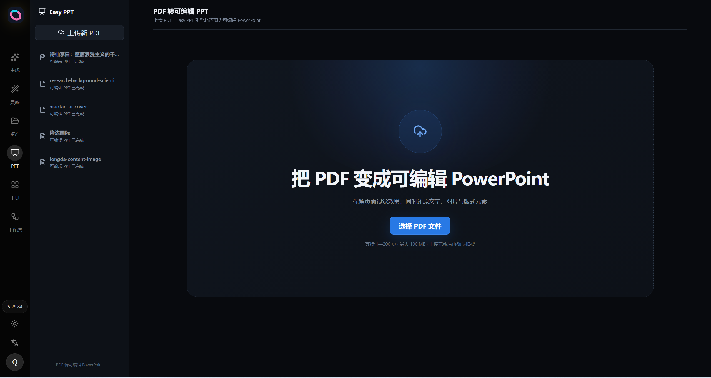
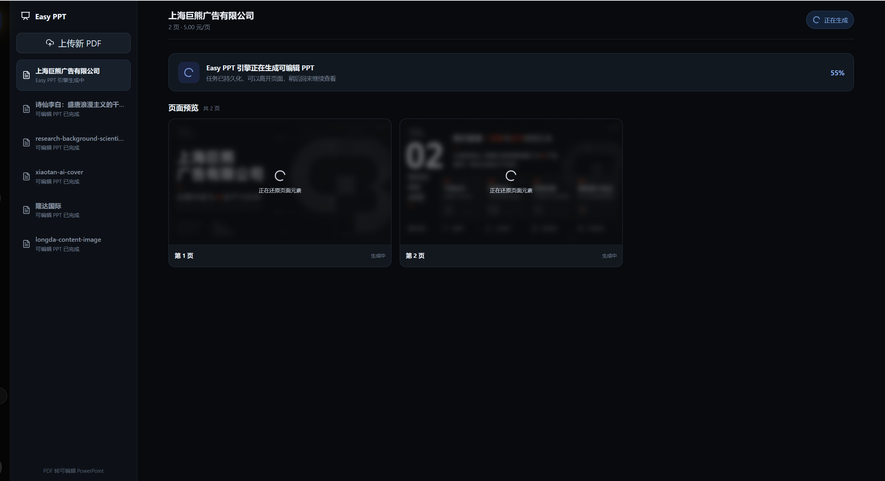
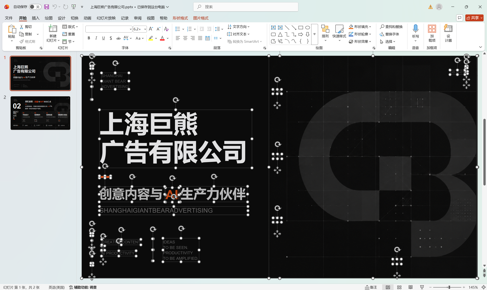
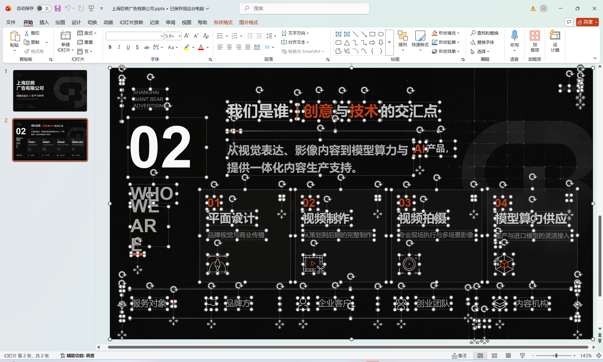

# Easy PPT

> 面向设计师与普通 AI 使用者的 Codex PPT 设计 Skill。让资料分析、大纲规划、视觉探索、逐页生成、精细修改与 PDF 交付形成一条可控、可审核的创作链路。

<p align="center">
  
  
  
  
  
</p>

## 项目简介

Easy PPT 旨在帮助设计师和普通 AI 使用者更高效地完成高质量演示文稿设计。

它并不是简单地“一键批量出图”，而是通过可控工作流，让用户能够先确认资料与大纲，再探索视觉方向，随后逐页生成、逐页审核、随时修改。每一页都以上一张已确认页面为风格参考，从而提升整套 PPT 的视觉一致性，同时为设计师保留充分的创作与调整空间。

Easy PPT 支持：

- 从 0 开始策划并制作 PPT；
- 读取 Word、PDF、PPT、表格、图片等资料并提炼内容；
- 基于 Codex 的分析能力与联网搜索能力补充、核验资料；
- 为已有 PPT 提供视觉美化、版式重构与内容排版；
- 生成多种视觉方向，并按选择逐页延续风格；
- 对单页继续修改，直到满足审核要求；
- 将最终页面合并为 PDF；
- 通过 Easy 创作平台把 PDF 转换为元素可编辑的 PowerPoint。

## 为什么选择 Easy PPT

| 能力 | 说明 |
| --- | --- |
| 风格连续 | 以上一页确认稿作为相邻风格参考，降低整套页面风格漂移 |
| 过程可控 | 大纲、风格和每一页都可以审核，不满意即可继续修改 |
| 资料驱动 | 可利用 Codex 读取本地资料、整理事实，并按需要联网补充信息 |
| 设计师友好 | 不强迫一键跑完，支持边审核、边补充素材、边推进下一页 |
| 并行工作 | 图片生成期间，设计师仍可继续处理资料、规划后续页面或开展其他工作 |
| 完整交付 | 支持图片页、PDF，以及通过 Easy 创作平台生成可编辑 PPT |

## 标准创作流程


当前版本默认采用**单页推进**：完成一页、审核一页、确认一页，再继续下一页。这样能够更好地控制文字、素材、版式与风格，也方便用户在制作过程中补充新资料或调整方向。

## 生成效果

以下示例展示了 Easy PPT 在统一视觉语言下生成封面页和内容页的效果。

### 封面页



### 内容页



## PDF 转可编辑 PowerPoint

完成整套页面并导出 PDF 后，可前往 [Easy 创作平台](https://create.easymax.ai) 的 PPT 板块，将 PDF 还原为可编辑 PowerPoint。

### 1. 上传 PDF



### 2. 查看转换进度

系统会按页恢复文字、图片和版式元素，转换任务可在后台持续运行。



### 3. 下载并编辑 PowerPoint

转换完成后可下载 `.pptx` 文件。文字、图片与版式元素均可在 PowerPoint 中继续选择和编辑。





## 模型与运行要求

| 项目 | 配置 |
| --- | --- |
| 基础视觉模型 | `gpt-image-2`（image-2） |
| 大语言模型 | `gpt-5.6-sol` |
| 图片服务 | `https://easymax.ai` |
| Codex 形态 | Codex Desktop / 支持 Skill 的 Codex 环境 |
| 本地运行时 | Node.js |

### 硬性条件

Easy PPT 调用的是 API Key 所对应的 `gpt-image-2` 能力，**并非 Codex 官方账号登录所附带的图片模型能力**。

使用前请确认：

1. 已通过 [CC-Switch](https://github.com/farion1231/cc-switch) 或兼容方式为 Codex 配置 `easymax.ai` 中转站；
2. 本地配置中存在以 `sk-` 开头的 API Key；
3. 该 API Key 同时支持基础大语言模型与 `gpt-image-2`；
4. 本机已安装 Node.js。若未安装，请前往 [Node.js 官网](https://nodejs.org) 下载并安装后，新建 Codex 对话再使用。

> Skill 会在运行时读取本地 API Key，并通过 EasyMax 的 OpenAI 兼容接口调用图片模型。仓库不包含、也不应写入任何 API Key。

## 安装教程

### 方式一：下载并手动安装

1. 点击 GitHub 项目页面右上角的 **Code → Download ZIP**；
2. 解压下载的压缩包；
3. 将项目目录放入 Codex 的 Skill 目录，并确保 `SKILL.md` 位于 `easy-ppt` 目录的第一层。

macOS / Linux：

```text
~/.codex/skills/easy-ppt/SKILL.md
```

Windows：

```text
%USERPROFILE%\.codex\skills\easy-ppt\SKILL.md
```

请避免出现重复嵌套目录，例如：

```text
~/.codex/skills/easy-ppt/easy-ppt/SKILL.md
```

安装后请新建对话；若 Skill 暂未出现，请重启 Codex。

### 方式二：让 Codex 协助安装

把本项目 GitHub 链接发送给 Codex，并附上以下内容：

```text
请安装或升级这个 Codex Skill：
https://github.com/xiaobai19198/easy-ppt

请将仓库安装到 ~/.codex/skills/easy-ppt；如已存在旧版本，请先备份，再完整升级程序文件，不要删除桌面 EasyPPT 项目和用户资料。安装后检查 SKILL.md 与 Node.js 脚本是否有效，并提示我新建对话或重启 Codex。
```

## 使用教程

1. 在 Codex 中点击左上角 **新对话**；
2. 在输入框中输入 `@PPT`；
3. 选择列表顶部蓝色的 **Easy PPT** Skill；
4. 按下回车，进入 PPT 制作模式；
5. 描述需求，并尽可能提供主题、受众、用途、页数、资料和视觉偏好；
6. 确认大纲和视觉方案后，逐页生成、审核与修改；
7. 全部页面确认后，生成并下载 PDF；
8. 如需元素可编辑版本，前往 [create.easymax.ai](https://create.easymax.ai) 转换为 PowerPoint。

### 示例指令

```text
我要制作一份面向高校管理层的 AI 升学服务合作方案，大约 12 页。
整体希望专业、可信、现代，主色使用深蓝和青色。
资料都在我接下来上传的文件里，请先分析资料并为我生成大纲。
```

已有 PPT 需要美化时，也可以直接说明：

```text
请美化这份 PPT。保留原有事实与页面顺序，重新设计版式和视觉层级。
目标受众是企业客户，希望整体简约、高级、有科技感。
```

## Easy AI 产品生态

推荐注册 Easy AI 旗下产品。任一平台完成注册后，账户与钱包额度通用。

### [EasyMax 中转站](https://easymax.ai)

为 Easy PPT 提供 OpenAI 兼容模型接口及 `gpt-image-2` 图片生成能力。

### [Easy 创作平台](https://create.easymax.ai)

提供图片制作、PDF 转可编辑 PPT 等创作能力。后续计划上线视频制作，并逐步支持 MiniMax H3 与 Seedance 系列模型。

## 当前版本与路线图

当前版本：`v1.0.10`

- [x] 从 0 制作 PPT
- [x] 资料读取、分析与大纲生成
- [x] PPT 美化与重新排版
- [x] 多视觉方向探索
- [x] 单页生成、审核与修改
- [x] 风格连续控制
- [x] PDF 合并与交付
- [x] PDF 转可编辑 PowerPoint
- [ ] 可选的多页并行生成
- [ ] 更完整的全自动执行模式
- [ ] 视频内容生产协同

> 并行全自动执行将在保证风格连续、文字质量和审核体验的前提下逐步开放。单页模式仍会保留，供设计师进行精细控制。

## 开发与维护

- Skill 开发：**上海青木星智能科技 Ltd**
- 基础视觉模型：**image-2**
- 大语言模型：**gpt-5.6-sol**

本仓库公开 Easy PPT Skill 源码，欢迎提交 Issue 反馈安装、模型调用、页面生成与跨平台兼容问题。

## 联系我们

产品咨询、问题反馈与商务合作，请扫描下方二维码联系我们。

<p align="center">
  
</p>

---

<p align="center">
  让 PPT 制作更轻松，让创意工作更专注。
</p>
